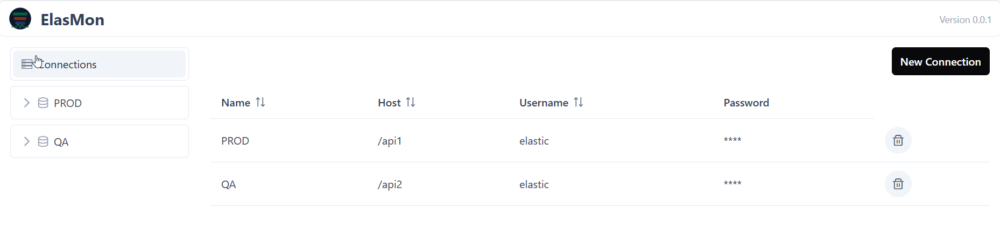
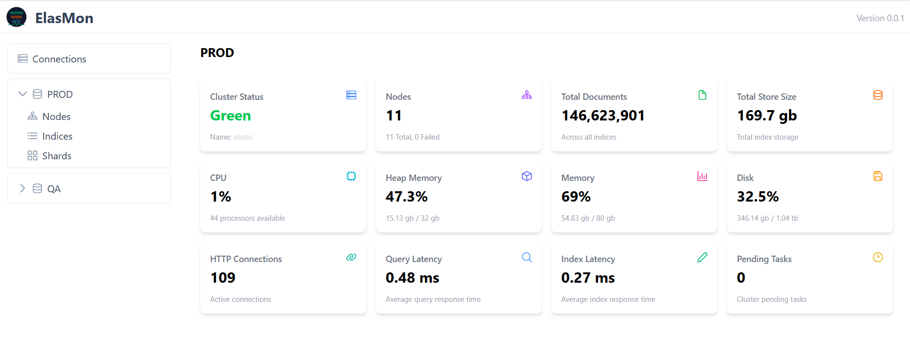

# ElasMon

A standalone desktop application for monitoring Elasticsearch clusters in real-time.

## Features

- **Cluster Overview**: Monitor cluster health, status, node count, documents, store size, CPU, memory, heap, and disk usage
- **Node Statistics**: View detailed node metrics including CPU, heap, memory, disk usage, thread pool rejections, shards per node, and uptime
- **Index Management**: Browse all indices with document counts, size, shards, replicas, and ingestion rate tracking
- **Shard Health**: Monitor active, primary, relocating, initializing, and unassigned shards
- **Multiple Connections**: Manage and switch between multiple Elasticsearch clusters
- **Auto Refresh**: Data automatically refreshes every 20 seconds

## Screenshots

### Clusters Dashboard


### Cluster Statistics


## Tech Stack

- **Frontend**: Angular 21, PrimeNG 21, Tailwind CSS 4
- **Desktop**: Electron 39
- **Language**: TypeScript

## Installation

### Build from Source

```bash
# Clone the repository
git clone https://github.com/hintdesk/elasmon.git
cd elasmon

# Install dependencies
npm install

# Run in development mode
npm start

# Build for production (Windows)
npm run electron:build
```

The built application will be available in the `release/win-unpacked` folder.

## Usage

1. Launch ElasMon
2. Click on "Connections" in the left panel
3. Add a new Elasticsearch connection with:
   - Name: A friendly name for the connection
   - URL: Elasticsearch cluster URL (e.g., `http://localhost:9200`)
   - Username/Password: Authentication credentials
4. Click Save and select the connection to start monitoring

## License

MIT License

## Author

[HintDesk](https://github.com/hintdesk)

## Support

If you find this project helpful, consider supporting its development:

[](https://ko-fi.com/hintdesk)
