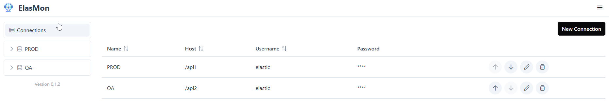
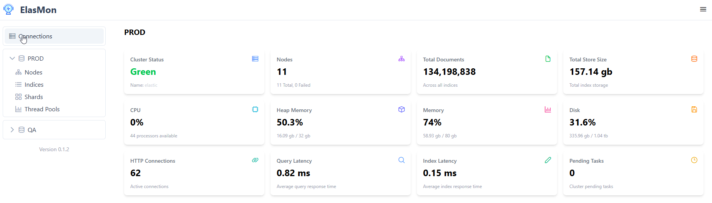
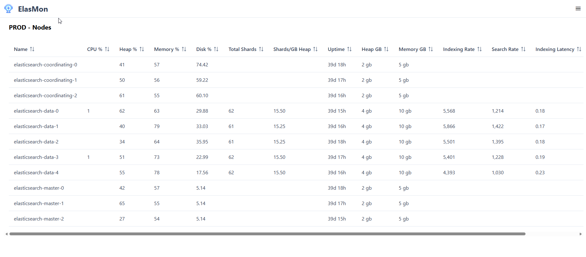
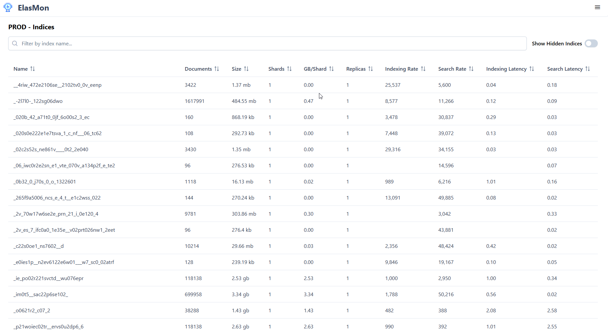
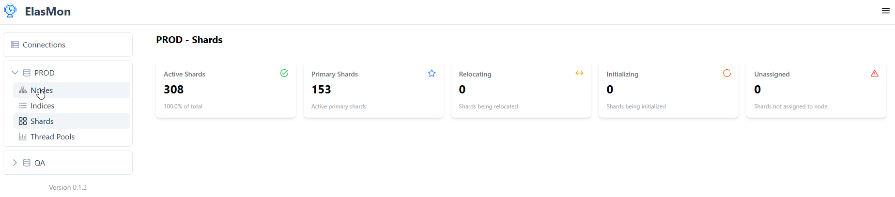
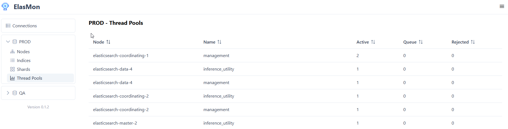
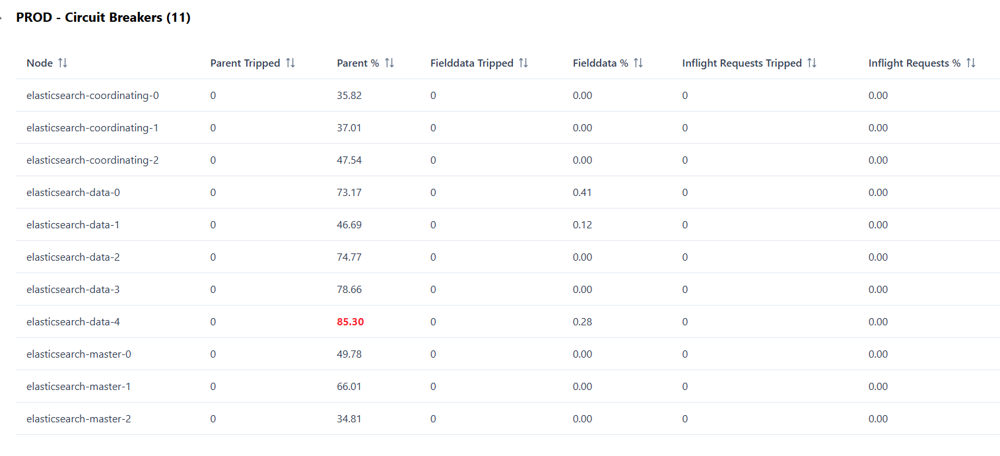

# ElasMon

ElasMon is a standalone desktop application for real-time Elasticsearch monitoring.

## Features

- Cluster Overview: Monitor health, status, node count, document count, store size, and high-level resource usage.
- Node Statistics: Track per-node CPU, heap, memory, disk usage, shard density, and uptime.
- Indices Statistics: View index-level documents, storage, shard/replica settings, and indexing/search rates.
- Shards Statistics: Monitor active, primary, relocating, initializing, and unassigned shards.
- Thread Pools: Inspect per-node pool activity, queue depth, and rejected tasks.
- Circuit Breakers: Monitor node-level `parent`, `fielddata`, and `inflight_requests` breakers, including tripped counts and usage percentages.
- Multiple Connections: Manage and switch between multiple Elasticsearch clusters.
- Auto Refresh: Metrics refresh automatically every 20 seconds.

## Screenshots

### Connections


### Cluster Overview


### Nodes


### Indices


### Shards


### Thread Pools


### Circuit Breakers


## Tech Stack

- Frontend: Angular 21, PrimeNG 21, Tailwind CSS 4
- Desktop: Electron 39
- Language: TypeScript

## Installation

### Build From Source

```bash
git clone https://github.com/hintdesk/elasmon.git
cd elasmon

npm install
npm start
```

### Build Desktop Package (Windows)

```bash
npm run electron:build
```

Build output is available in `release/win-unpacked`.

## Usage

1. Launch ElasMon.
2. Open Connections from the left panel.
3. Add an Elasticsearch connection:
   - Name: Friendly display name.
   - URL: Cluster endpoint (example: `http://localhost:9200`).
   - Username/Password: Authentication credentials.
4. Save and select a connection.
5. Navigate to Nodes, Indices, Shards, Thread Pools, or Circuit Breakers to monitor cluster behavior in real time.

## License

MIT

## Author

[HintDesk](https://github.com/hintdesk)

## Support

If this project is helpful, you can support development here:

[](https://ko-fi.com/hintdesk)
